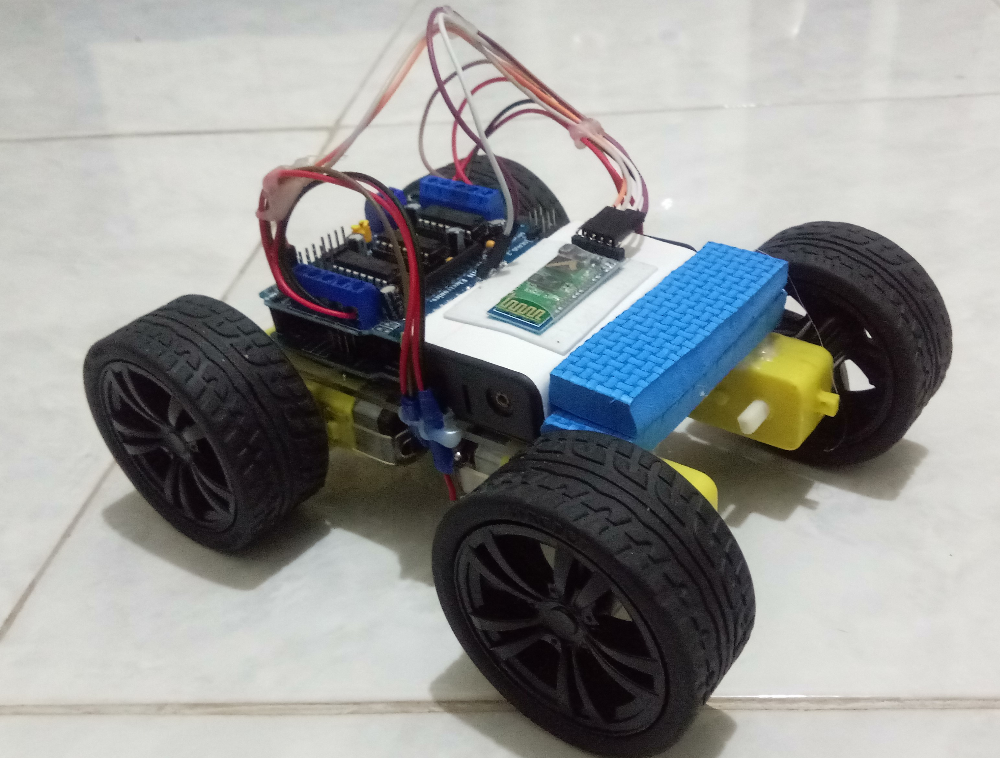

# arduinoBluetoothCar
Arduino car toy with controller has connected with bluetooth 🚗

Hello (ʘ‿ʘ)╯

This Project Using
1. Arduino Uno
2. Driver Shield L293D Arduino Uno
3. Motor DC 4x
4. Battery 18650
5. Wheels
6. Bluetooth Module HC-05
7. Jumper Cable
8. Box Battery 2x 18650
9. Switch On/Off
10. Mini Breadboard

For control you can use 2 application below :
- https://play.google.com/store/apps/details?id=braulio.calle.bluetoothRCcontroller
- https://play.google.com/store/apps/details?id=com.giumig.apps.bluetoothserialmonitor

# Diagram 

# Preview

